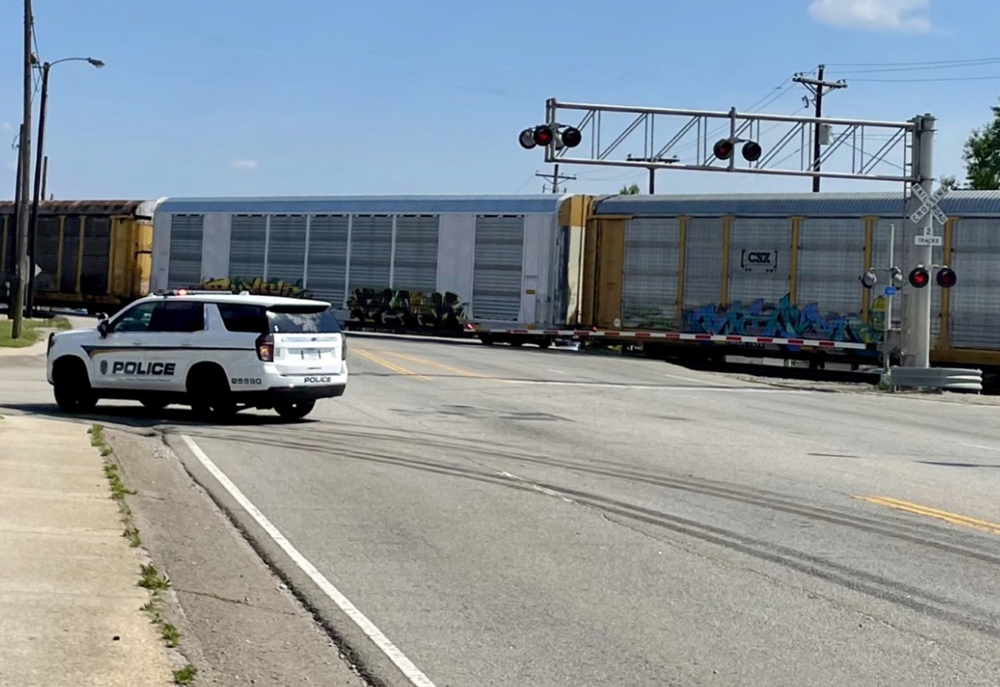

<!-- 第一个项目 -->

  <h2>AI-enabled EMS Operation Planning for Acute Medical Events</h2>

  

    
  

  

    

      <strong>Research Summary:</strong> This research aims to improve emergency medical service (EMS) operations by reducing response and travel times for acute medical events linked to chronic conditions. By combining large-scale medical, travel, and demographic data with AI techniques, it enables accurate event prediction and proactive EMS vehicle deployment. 
    

  

<!-- 第二个项目 -->

  <h2>Healthcare Travel burdens Survey in South Carolina</h2>

  

    
  

  

    

      <strong>Research Summary:</strong> This research aims to understand how transportation barriers impact healthcare access in diverse communities. By combining perception-based survey data with demographic and built environment information, it identifies key mobility challenges faced by vulnerable populations and informs equitable, data-driven transportation and health policy.
    

  

<!-- 第三个项目 -->

 <h2>Optimizing Emergency Response: Intelligent Routing Decision Support System for First Responders at Rail Crossings</h2>

  

    
  

  

    

      <strong>Research Summary:</strong> This project aims to improve emergency response effectiveness at rail crossings by developing an Intelligent Routing Decision Support System tailored to their unique challenges. By integrating real-time rail, traffic, and incident data with advanced routing algorithms, the system provides first responders with optimized, context-aware routes.
    

  

<h1> Sponsors</h1>

  
  
  

